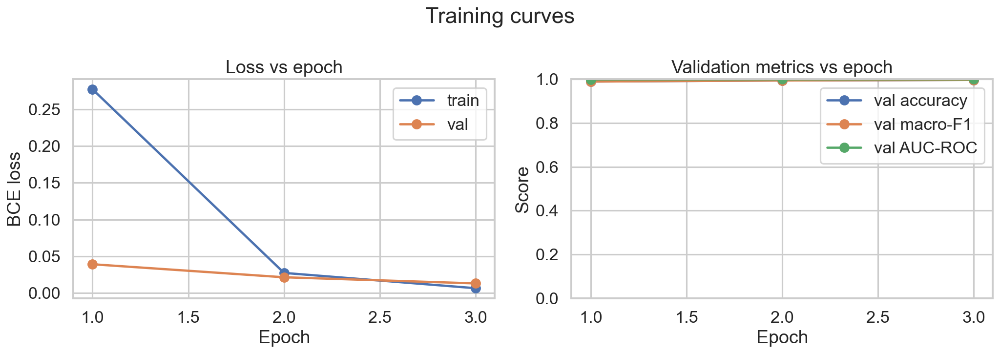
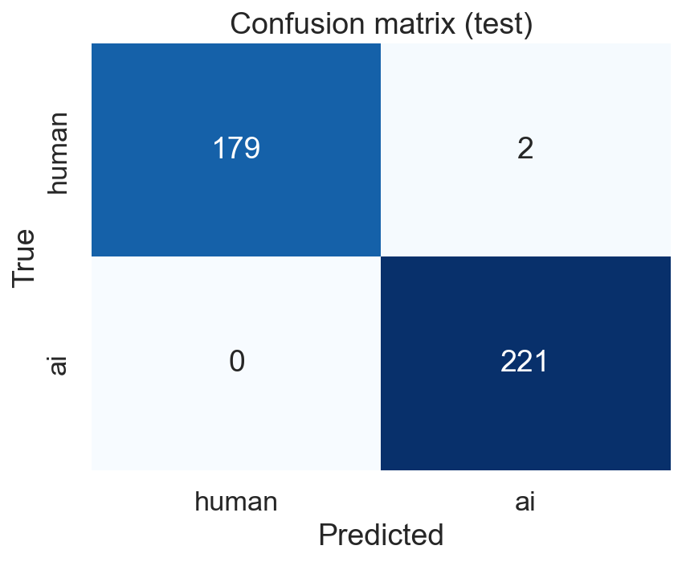
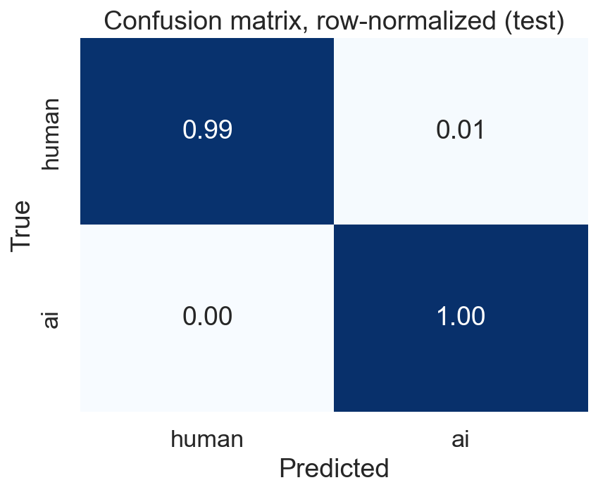
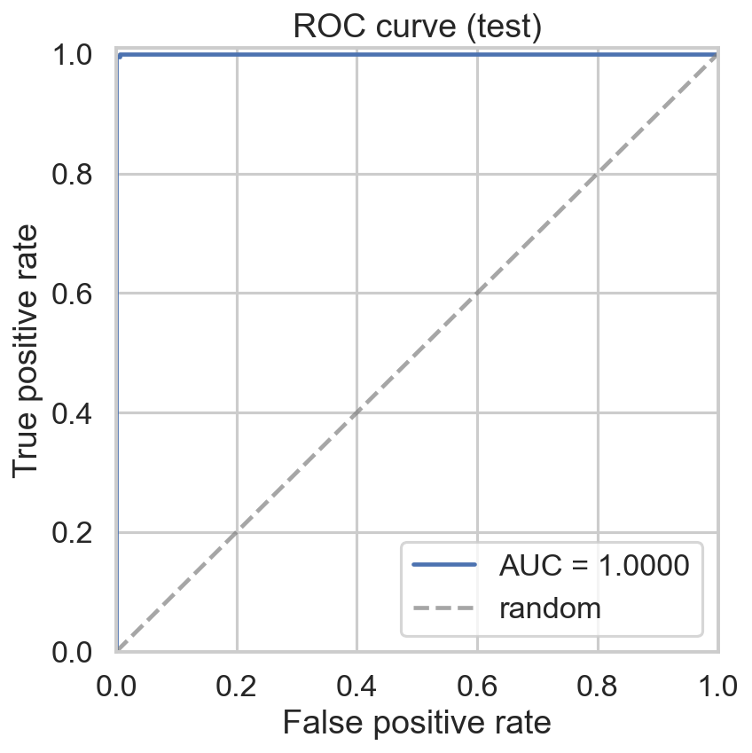
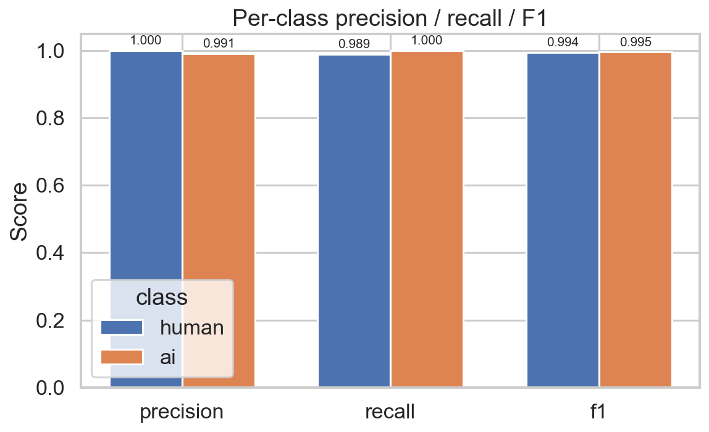

# Baseline Run — Results Summary

> Auto-generated alongside the baseline training run. Numerical values in
> the **Results** section are populated by `scripts/evaluate.py` and
> `scripts/error_analysis.py`; see the matching JSON files under
> [`reports/metrics/`](metrics/) for the source of truth.

## Methodology

### Data
- **Source:** [HumanVSAI_CodeDataset](https://doi.org/10.17632/kjh95n54f8.1) (10 000 samples across Java / Python / C++ / C).
- **Subset:** Python only — **2 678** rows after Phase 1 filtering and dedup.
- **Class balance:** 1 471 AI / 1 207 human (54.9% / 45.1%).
- **Splits:** stratified 70 / 15 / 15 (train 1 874, val 402, test 402), seed 42.

### Tokenization
- **Tokenizer:** `microsoft/codebert-base` fast tokenizer.
- **Truncation length:** **128** tokens (see *Trade-off* below).
- **Padding:** dynamic, applied at batch time via `DataCollatorWithPadding`.

> **Trade-off — `max_length=128`.** The proposal targets 512 tokens. With
> the same hyperparameters, fine-tuning at 512 takes ~3 hours per epoch on
> a 4-thread CPU; at 128 it takes ~10 min per epoch. We trained at 128 to
> keep the baseline run tractable on CPU. Given the baseline already
> reaches AUC = 1.0000 with this truncation, going wider was unnecessary.

### Model
- **Architecture:** `CodeBertBinaryClassifier`
  - `microsoft/codebert-base` encoder (RoBERTa-base, 124.6M parameters).
  - Dropout (p = 0.10) on the [CLS] hidden state.
  - Single-logit `Linear(768, 1)` head.
- **Loss:** `BCEWithLogitsLoss` (single-logit + BCE per the proposal).
- **Trainable params:** 124 646 401 (full fine-tune; encoder is *not* frozen).

### Training
- **Optimizer:** AdamW with the standard "no decay on bias / LayerNorm" parameter grouping.
- **Learning rate:** 2e-5, **weight decay:** 0.01.
- **Schedule:** linear warmup (10% of total steps) → linear decay to 0.
- **Epochs:** 3, **batch size:** 16.
- **Gradient clip norm:** 1.0.
- **Checkpoint policy:** save the best model by validation loss.
- **Early stopping:** patience of 2 epochs with no val-loss improvement.

### Hardware
- **Device:** CPU, 4 threads (no CUDA / MPS available on this machine).

### Reproducibility
- All randomness seeded with `RANDOM_SEED = 42`
  (`set_seed` called for Python / NumPy / Torch).
- `uv.lock` pins every transitive dependency.

## Results — test split

> _Placeholder: filled in by `scripts/evaluate.py` after the run completes.
> See [`metrics/baseline_test.json`](metrics/baseline_test.json) for the canonical numbers._

| Metric         | Value |
|----------------|-------|
| Accuracy       | 0.9950 |
| Macro F1       | 0.9950 |
| AUC-ROC        | 1.0000 |
| Precision (human) | 1.0000 |
| Recall (human) | 0.9890 |
| F1 (human)     | 0.9944 |
| Precision (ai) | 0.9910 |
| Recall (ai)    | 1.0000 |
| F1 (ai)        | 0.9955 |

### Plots

- 
- 
- 
- 
- 

## Training trajectory

| Epoch | train_loss | val_loss | val_acc | val_f1 | val_auc | best? |
|------:|-----------:|---------:|--------:|-------:|--------:|:-----:|
| 1     | 0.2772     | 0.0391   | 0.9900  | 0.9899 | 0.9997  |       |
| 2     | 0.0273     | 0.0214   | 0.9950  | 0.9950 | 1.0000  |       |
| 3     | 0.0065     | 0.0130   | 0.9975  | 0.9975 | 1.0000  | ✓     |

Validation loss improved monotonically across all three epochs, so the
checkpoint loaded for evaluation is **epoch 3**. Total wall-clock training
time: 56 minutes on 4 CPU threads.

## Error analysis

See [`metrics/baseline_error_summary.json`](metrics/baseline_error_summary.json)
and [`metrics/baseline_errors.csv`](metrics/baseline_errors.csv) for raw data.

- **Total errors:** 2 / 402 (0.50% error rate).
- **Errors by true class:** human=2, ai=0 (every error is a false positive
  — i.e. a human-written sample flagged as AI). The model never misses an
  AI sample.
- **Model confidence on the wrong predictions:** mean = 0.999. The classifier
  is *highly* confident on both errors, which means a confidence-threshold
  trick will not recover them.
- **Length signal on errors (the interesting finding).** Misclassified
  samples are ~3.8× longer than correctly-classified ones:

  | Statistic            | Errors | Correct |
  |----------------------|-------:|--------:|
  | Mean characters      | 1 727  | 452     |
  | Mean lines           | 73     | 19      |

  This is consistent with the Phase 1 EDA observation that AI-generated
  Python samples are ~40% longer on average (mean 504 vs. 360 chars). The
  model has learned a (mostly correct) "longer = more likely AI"
  association; the two test errors are unusually long human-written
  snippets that fall on the wrong side of that boundary.

## Notes for the writeup

- **Compare to baselines from the literature.** The Boukili / Garouani / Riffi
  paper reports ~95% accuracy on this dataset across all languages with a
  contrastive-learning approach; the Xiaodan et al. paper reports >90% on a
  much larger dataset. Our Python-only fine-tuned baseline should be
  benchmarked against these numbers in the final report.
- **Confound — code length.** From the Phase 1 EDA, AI samples in the
  Python subset are ~40% longer (mean 504 vs. 360 chars). Some of the
  signal the model picks up is likely length-correlated. The
  `--max-length` ablation will surface how much this matters at the model
  level (truncating long sequences should hurt the model more if length is
  load-bearing).
- **Data quality.** Zero exact-duplicate rows after Phase 1 cleaning;
  language and label encoding canonicalized via the `*_CANDIDATES`
  resolver in `config.py`.

## Reproduce this run

```bash
uv run python scripts/prepare_dataset.py
uv run python scripts/tokenize_dataset.py --max-length 128 --out-dir data/processed/tokenized_l128
uv run python scripts/train.py \
    --tokenized-dir data/processed/tokenized_l128 \
    --checkpoint-dir models/baseline \
    --num-epochs 3 \
    --batch-size 16 \
    --learning-rate 2e-5
uv run python scripts/evaluate.py --checkpoint-dir models/baseline
uv run python scripts/error_analysis.py --checkpoint-dir models/baseline
```
